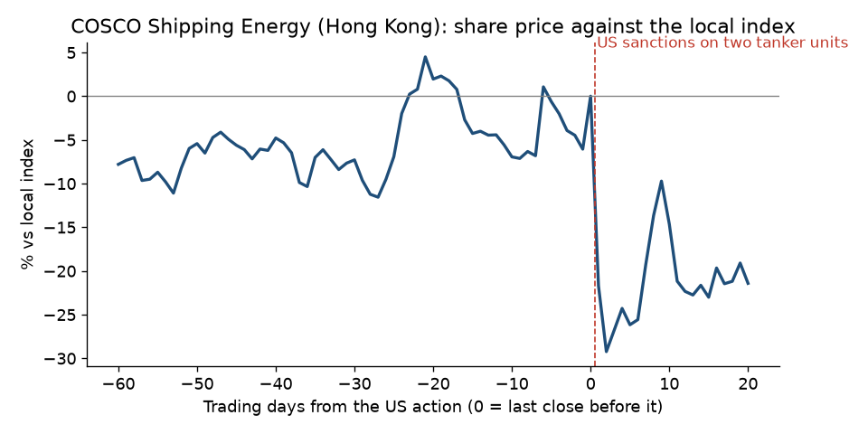

# COSCO Shipping Energy, 2019: tanker units sanctioned

**Short answer: the US warned the industry two months earlier, but nothing public named COSCO. The shares rose 7% beforehand.**

## What happened

- **The action:** on 2019-09-25 the US sanctioned COSCO Shipping Tanker (Dalian) and its ship-management arm for carrying Iranian oil ([State Department release](https://github.com/pvijeh/iran-oil-terminals/blob/main/receipts/case-studies/2019-09-25_state_cosco-dalian-sanctioned.html)). Tankers are COSCO Shipping Energy's main business.
- **Afterwards:** the US lifted these sanctions in January 2020 ([Wikipedia, sourced](https://github.com/pvijeh/iran-oil-terminals/blob/main/receipts/case-studies/wikipedia_COSCO_Shipping_2026-10-06.wikitext)).

## Warning signs before the action

- **2019-07-22:** the US sanctioned the Chinese oil trader Zhuhai Zhenrong for buying Iranian oil after China's exemption ended in May 2019 ([State Department release](https://github.com/pvijeh/iran-oil-terminals/blob/main/receipts/case-studies/2019-07-22_state_zhuhai-zhenrong-sanctioned.html)). This showed the US would now sanction Chinese companies in the Iranian oil trade.
- **Naming COSCO:** we found no public report or filing before 2019-09-25 that linked COSCO's tankers to Iranian oil. We did not search ship-tracking reports from that time.

## Share price before and after

- **Before the action (against the local index):** +6.8% over 60 trading days, −2.0% over 20, +0.6% over 5.
- **After:** −21.7% after 1 trading day, −26.2% after 5, −21.4% after 20.

## What this shows

- **A general warning didn't move the price.** The fall came only when the US named the company.

## How we measured

- **Share move:** the company's share price change minus the local index change, from daily closing prices (Yahoo Finance).
- **Before:** from the close 60, 20 and 5 trading days before the action, up to the last close before it.
- **After:** from that last close to 1, 5 and 20 trading days later.
- **Data and code:** [case_study_summary.csv](https://github.com/pvijeh/iran-oil-terminals/blob/main/data/case_study_summary.csv), [case_study_price_paths.csv](https://github.com/pvijeh/iran-oil-terminals/blob/main/data/case_study_price_paths.csv), [scripts/case_studies.py](https://github.com/pvijeh/iran-oil-terminals/blob/main/scripts/case_studies.py).
- **Saved sources:** [receipts/case-studies](https://github.com/pvijeh/iran-oil-terminals/tree/main/receipts/case-studies).

[Back to the main report](../#was-there-warning-before-the-biggest-falls) · [All case studies](./)
