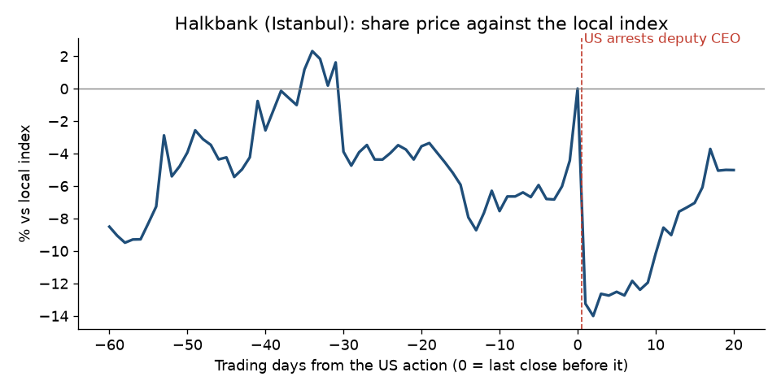

# Halkbank, 2017: deputy CEO arrested

**Short answer: the warnings were very public, three years early and again one year early. The shares rose 13% beforehand.**

## What happened

- **The action:** on 2017-03-28 the US Justice Department announced the arrest of Halkbank's deputy CEO, Mehmet Hakan Atilla, for helping Iran evade US sanctions ([Justice Department release](https://www.justice.gov/usao-sdny/pr/turkish-banker-arrested-conspiring-evade-us-sanctions-against-iran-and-other-offenses)).

## Warning signs before the action

- **2013-12-17:** Turkish police detained Halkbank's general manager in a corruption investigation that included breaking sanctions on Iran ([Wikipedia, sourced](https://github.com/pvijeh/iran-oil-terminals/blob/main/receipts/case-studies/wikipedia_2013_corruption_scandal_in_Turkey_2026-10-06.wikitext)).
- **2016-03-19:** the US arrested Reza Zarrab, the gold trader whose Iran payments scheme ran through Halkbank ([court complaint](https://storage.courtlistener.com/recap/gov.uscourts.nysd.451245/gov.uscourts.nysd.451245.2.0.pdf)).
- **Halkbank's own filings:** not checked.

## Share price before and after

- **Before the action (against the local index):** +13.1% over 60 trading days, +3.9% over 20, +6.3% over 5.
- **After:** −13.3% after 1 trading day, −12.5% after 5, −5.0% after 20.

## What this shows

- **The market ignored years of public evidence and fell only when a senior Halkbank officer was arrested.** Part of the fall had recovered within a month.
- **Halkbank's longer decline:** from 2015 to 2019 Halkbank fell 58% while the Turkish bank index was flat. See [the main report](../findings.html#which-listed-banks-could-be-cut-off-next).

## How we measured

- **Share move:** the company's share price change minus the local index change, from daily closing prices (Yahoo Finance).
- **Before:** from the close 60, 20 and 5 trading days before the action, up to the last close before it.
- **After:** from that last close to 1, 5 and 20 trading days later.
- **Data and code:** [case_study_summary.csv](https://github.com/pvijeh/iran-oil-terminals/blob/main/data/case_study_summary.csv), [case_study_price_paths.csv](https://github.com/pvijeh/iran-oil-terminals/blob/main/data/case_study_price_paths.csv), [scripts/case_studies.py](https://github.com/pvijeh/iran-oil-terminals/blob/main/scripts/case_studies.py).
- **Saved sources:** [receipts/case-studies](https://github.com/pvijeh/iran-oil-terminals/tree/main/receipts/case-studies).

[Back to the main report](../) · [Full findings](../findings.html#was-there-warning-before-the-biggest-falls) · [All case studies](./)
