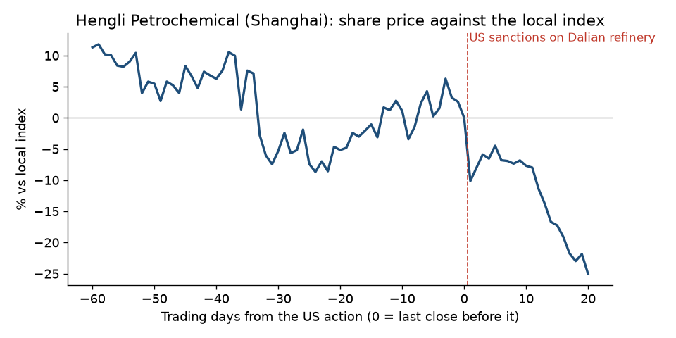

# Hengli Petrochemical, 2026: Dalian refinery sanctioned

**Short answer: the warning was the trend, not anything naming Hengli. The detailed reporting came after.**

## What happened

- **The action:** on 2026-04-24 the US sanctioned Hengli Petrochemical (Dalian) Refinery. Treasury called it "one of Iran's largest customers" for crude oil and said it had bought "billions of dollars' worth" of Iranian petroleum ([Treasury release](https://github.com/pvijeh/iran-oil-terminals/blob/main/receipts/case-studies/2026-04-24_treasury_sb0472_hengli.html)).
- **The company's response:** Hengli said in an exchange filing that it had never traded with Iran (Reuters, 2026-04-26, cited in [Wikipedia](https://github.com/pvijeh/iran-oil-terminals/blob/main/receipts/case-studies/wikipedia_Hengli_Group_2026-10-06.wikitext)).

## Warning signs before the action

- **The trend:** from March to October 2025 the US sanctioned four Chinese oil terminals for taking Iranian oil. They were part-owned by listed companies such as Wintime Energy, Qingdao Port, PetroChina and Sinopec Kantons ([our ledger](https://github.com/pvijeh/iran-oil-terminals/blob/main/data/iran_enforcement_price_impact.csv)).
- **Naming Hengli:** we found no public report before 2026-04-24. We did not search Hengli's own Shanghai filings before the action.
- **After the action:** Treasury warned about Chinese independent refineries on 2026-04-28 ([Treasury release](https://github.com/pvijeh/iran-oil-terminals/blob/main/receipts/case-studies/2026-04-28_treasury_sb0476_teapot-warning.html)). The Wall Street Journal published an investigation of Hengli on 2026-08-16.

## Share price before and after

- **Before the action (against the local index):** −10.0% over 60 trading days, +6.0% over 20, −0.2% over 5.
- **After:** −10.1% after 1 trading day, −4.5% after 5, −25.0% after 20. The first-day fall was the −10% daily limit on the Shanghai exchange.

## What this shows

- **The shares fell 10% against the index in the three months before, then recovered in the last month.** We did not find news that explains the earlier fall.

## How we measured

- **Share move:** the company's share price change minus the local index change, from daily closing prices (Yahoo Finance).
- **Before:** from the close 60, 20 and 5 trading days before the action, up to the last close before it.
- **After:** from that last close to 1, 5 and 20 trading days later.
- **Data and code:** [case_study_summary.csv](https://github.com/pvijeh/iran-oil-terminals/blob/main/data/case_study_summary.csv), [case_study_price_paths.csv](https://github.com/pvijeh/iran-oil-terminals/blob/main/data/case_study_price_paths.csv), [scripts/case_studies.py](https://github.com/pvijeh/iran-oil-terminals/blob/main/scripts/case_studies.py).
- **Saved sources:** [receipts/case-studies](https://github.com/pvijeh/iran-oil-terminals/tree/main/receipts/case-studies).

[Back to the main report](../#was-there-warning-before-the-biggest-falls) · [All case studies](./)
