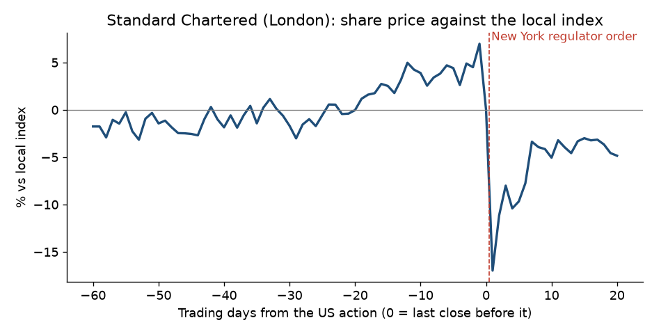

# Standard Chartered, 2012: New York regulator order

**Short answer: the bank knew about the problem from 2009, but we couldn't confirm the market did. The shares fell 17% the day after the order.**

## What happened

- **The action:** on 2012-08-06, after the London close, New York's financial regulator (DFS) accused Standard Chartered of hiding about 60,000 payments for Iranian clients, worth about US$250bn, from 2001 to 2007. It threatened the bank's licence to operate in New York ([DFS order](https://github.com/pvijeh/iran-oil-terminals/blob/main/receipts/case-studies/2012-08-06_nydfs_standard-chartered-order.pdf)).
- **Afterwards:** on 2012-08-14 the bank settled with DFS for US$340M ([Wikipedia, sourced](https://github.com/pvijeh/iran-oil-terminals/blob/main/receipts/case-studies/wikipedia_Standard_Chartered_2026-10-06.wikitext)).

## Warning signs before the action

- **What the order says:** Standard Chartered began an internal investigation in early 2009 after law enforcement contacted it, and told DFS about it in May 2010 ([DFS order](https://github.com/pvijeh/iran-oil-terminals/blob/main/receipts/case-studies/2012-08-06_nydfs_standard-chartered-order.pdf), paragraph 53).
- **Not verified:** whether the bank disclosed the US inquiries in its own annual reports before 2012. We think it did, but we haven't checked.

## Share price before and after

- **Before the action (against the local index):** +2.0% over 60 trading days, 0.0% over 20, −4.4% over 5.
- **After:** −17.0% after 1 trading day, −9.7% after 5, −4.9% after 20. "After 1 day" is 2012-08-07, the first London session after the order.

## What this shows

- **The surprise was the size of the claim and the threat to the licence, not the investigation itself.** The fall halved once the bank settled.

## How we measured

- **Share move:** the company's share price change minus the local index change, from daily closing prices (Yahoo Finance).
- **Before:** from the close 60, 20 and 5 trading days before the action, up to the last close before it.
- **After:** from that last close to 1, 5 and 20 trading days later.
- **Data and code:** [case_study_summary.csv](https://github.com/pvijeh/iran-oil-terminals/blob/main/data/case_study_summary.csv), [case_study_price_paths.csv](https://github.com/pvijeh/iran-oil-terminals/blob/main/data/case_study_price_paths.csv), [scripts/case_studies.py](https://github.com/pvijeh/iran-oil-terminals/blob/main/scripts/case_studies.py).
- **Saved sources:** [receipts/case-studies](https://github.com/pvijeh/iran-oil-terminals/tree/main/receipts/case-studies).

[Back to the main report](../findings.html#was-there-warning-before-the-biggest-falls) · [All case studies](./)
