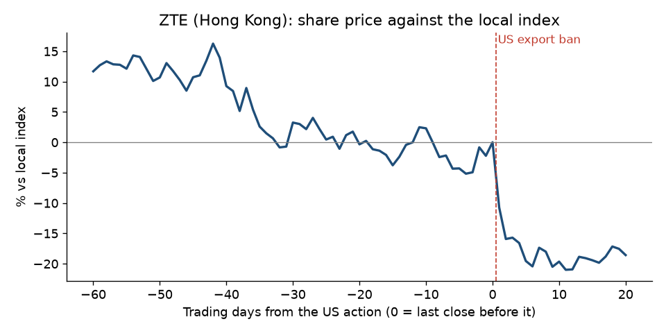

# ZTE, 2016: US export ban

**Short answer: the warning came four years early, in the press. The shares didn't react until the US acted.**

## What happened

- **The action:** on 2016-03-07 the US Commerce Department added ZTE and three related companies to its Entity List, which bars US suppliers from selling to them without a licence ([Federal Register notice](https://github.com/pvijeh/iran-oil-terminals/blob/main/receipts/case-studies/2016-03-08_federal-register_zte-entity-list.pdf)). ZTE built its phones and network equipment with US chips.
- **Why:** sales of equipment containing US parts to Iran.
- **Trading halt:** ZTE's Hong Kong shares were suspended from 2016-03-07 to 2016-04-06. The "after" figures start from the first day of trading after the halt.

## Warning signs before the action

- **2012-03-22, Reuters:** reported that ZTE had sold Iran's main telecom company, TCI, a surveillance system able to monitor phone and internet traffic. It was part of a EUR 98.6M contract signed in December 2010 ([saved copy](https://github.com/pvijeh/iran-oil-terminals/blob/main/receipts/case-studies/2012-03-22_reuters_zte-iran-surveillance.html)).
- **ZTE's own filings:** not checked. We did not search ZTE's Hong Kong announcements from 2012-2016 for Iran.

## Share price before and after

- **Before the action (against the local index):** −8.7% over 60 trading days, +0.4% over 20, +4.9% over 5.
- **After:** −10.8% after 1 trading day, −19.6% after 5, −18.6% after 20.

## What this shows

- **The evidence was public for four years.** The shares fell 9% against the index in the three months before the ban but were flat in the last month. The big fall came only after the ban.

## How we measured

- **Share move:** the company's share price change minus the local index change, from daily closing prices (Yahoo Finance).
- **Before:** from the close 60, 20 and 5 trading days before the action, up to the last close before it.
- **After:** from that last close to 1, 5 and 20 trading days later.
- **Data and code:** [case_study_summary.csv](https://github.com/pvijeh/iran-oil-terminals/blob/main/data/case_study_summary.csv), [case_study_price_paths.csv](https://github.com/pvijeh/iran-oil-terminals/blob/main/data/case_study_price_paths.csv), [scripts/case_studies.py](https://github.com/pvijeh/iran-oil-terminals/blob/main/scripts/case_studies.py).
- **Saved sources:** [receipts/case-studies](https://github.com/pvijeh/iran-oil-terminals/tree/main/receipts/case-studies).

[Back to the main report](../) · [Full findings](../findings.html#was-there-warning-before-the-biggest-falls) · [All case studies](./)
