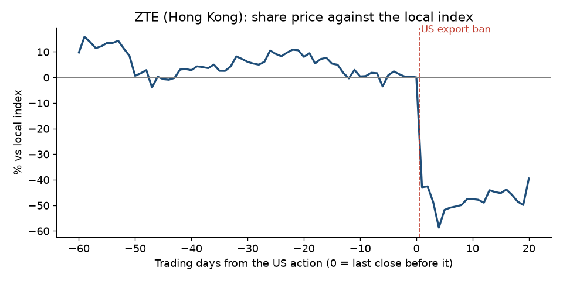

# ZTE, 2018: the export ban that kicked in

**Short answer: this is the one case where an official document warned of the exact penalty a year ahead. The shares still fell only 7-8% beforehand and 43% after.**

## What happened

- **The action:** on 2018-04-16 the US Commerce Department banned US companies from selling to ZTE for seven years ([Federal Register notice](https://github.com/pvijeh/iran-oil-terminals/blob/main/receipts/case-studies/2018-04-23_federal-register_zte-denial-order.pdf)).
- **Why:** ZTE had made false statements to the US about disciplining the staff behind its Iran sales, which broke the terms of its 2017 settlement.
- **Trading halt:** ZTE's Hong Kong shares were suspended from 2018-04-17 to 2018-06-12. By the time trading restarted, ZTE had agreed a new US settlement, so the fall after includes both the ban and the settlement.

## Warning signs before the action

- **2017-03-07, guilty plea:** ZTE pleaded guilty to shipping US goods to Iran and agreed to pay US$892M, with another US$300M suspended ([Justice Department release](https://github.com/pvijeh/iran-oil-terminals/blob/main/receipts/case-studies/2017-03-07_doj_zte-guilty-plea.html)).
- **The suspended ban:** the March 2017 settlement included a seven-year export ban, suspended unless ZTE broke the terms. The 2018 notice quotes this ([Federal Register notice](https://github.com/pvijeh/iran-oil-terminals/blob/main/receipts/case-studies/2018-04-23_federal-register_zte-denial-order.pdf)).
- **Not public:** the false statements themselves, in letters ZTE sent to the US in 2016 and 2017. They came out only on the day of the ban.

## Share price before and after

- **Before the action (against the local index):** −8.3% over 60 trading days, −6.9% over 20, −0.9% over 5.
- **After:** −42.9% after 1 trading day, −51.8% after 5, −39.5% after 20.

## What this shows

- **Everyone could read the penalty, but no one knew it had been triggered.** The slide beforehand was small compared with the fall after.

## How we measured

- **Share move:** the company's share price change minus the local index change, from daily closing prices (Yahoo Finance).
- **Before:** from the close 60, 20 and 5 trading days before the action, up to the last close before it.
- **After:** from that last close to 1, 5 and 20 trading days later.
- **Data and code:** [case_study_summary.csv](https://github.com/pvijeh/iran-oil-terminals/blob/main/data/case_study_summary.csv), [case_study_price_paths.csv](https://github.com/pvijeh/iran-oil-terminals/blob/main/data/case_study_price_paths.csv), [scripts/case_studies.py](https://github.com/pvijeh/iran-oil-terminals/blob/main/scripts/case_studies.py).
- **Saved sources:** [receipts/case-studies](https://github.com/pvijeh/iran-oil-terminals/tree/main/receipts/case-studies).

[Back to the main report](../) · [Full findings](../findings.html#was-there-warning-before-the-biggest-falls) · [All case studies](./)
