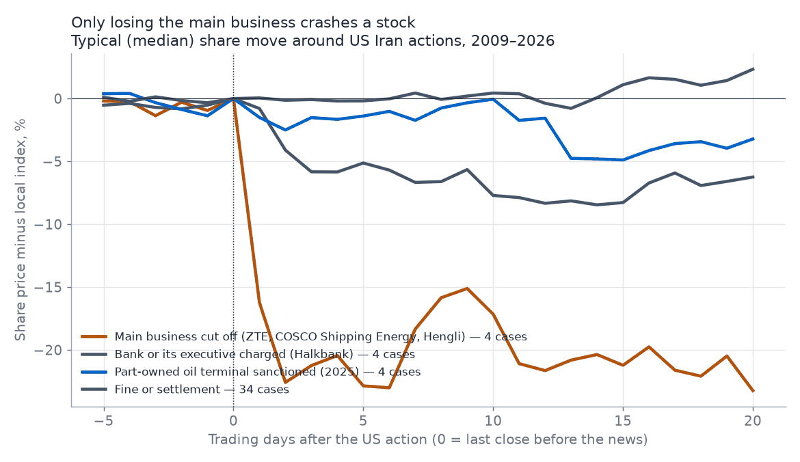
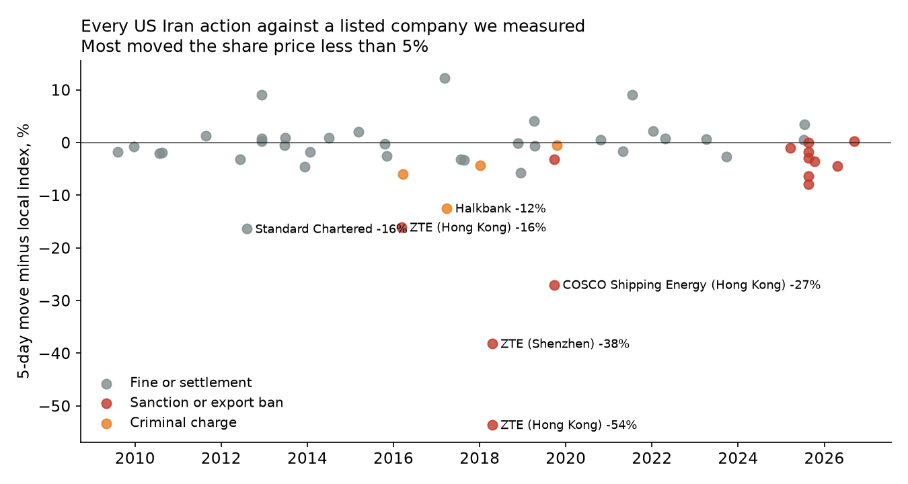
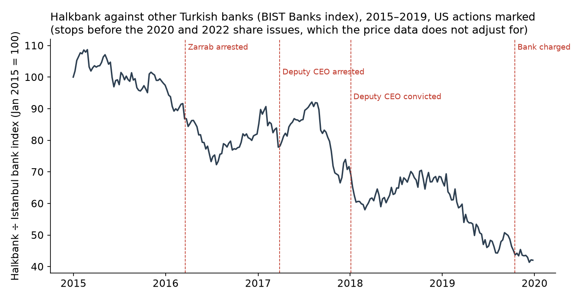

# Which listed companies could be hit next by US sanctions on Iran

## Executive summary

- **What this is:** a check, using only public data, of which stock-market-listed companies, mainly in Hong Kong, mainland China and Taiwan, do business that the US now sanctions as helping Iran.
- **Why it matters:** in 2026 the US widened its Iran sanctions from oil to cars, rail, shipping, aviation, technology, gold and crypto. A foreign company caught in one of these sectors can be cut off from US banks and the dollar. If it is listed, its profit and share price take the hit.
- **Where we looked:**
  - The US Iran regulations, executive orders and Treasury press releases.
  - Every US Treasury sanctions fine published from 2018 to 2025, and share prices around 50 US actions since 2009.
  - US sanctions lists (OFAC, OpenSanctions), matched to listed owners through Hong Kong and mainland Chinese company filings.
  - 220,000 port visits by 669 sanctioned ships, from Global Fishing Watch.
  - Ukraine's database of parts found in Iranian drones, and Iran's largest online shop, Digikala.
- **What we found:**
  - **Already hit:** two Hong Kong-listed companies own Chinese oil terminals the US has sanctioned. Sinopec Kantons (00934) lost a terminal that made about 12% of its 2024 pre-tax profit. Qingdao Port (06198) owns 70% of another.
  - **Likely next, car suppliers:** since 2026-10-01 any company selling to Iran's two big carmakers can be sanctioned. Linglong Tyre (SSE 601966) named Iran Khodro as a customer as recently as 2024, and Anpeilong (SZSE 301413) named an Iranian supplier to both carmakers in 2023.
  - **Likely next, banks:** the US cut off banks in the UAE, Turkey and Russia in August and September 2026 for moving money for Iran.
  - **Oil terminals:** free ship tracking can't show which terminal is next, because sanctioned tankers stop showing up at Chinese piers once sanctioned. The one exception is seven sanctioned gas carriers docking openly at Chaozhou, in southern China.
- **Price impact:** since 2009, fines have barely moved share prices. Being cut off has: ZTE fell 41% in a day in 2018, COSCO Shipping Energy 27% in a week in 2019, and mainland-only Hengli 25% in a month in 2026.
- **Where to look:** the biggest falls came when a company's main business was cut off. We rank five areas to look for the next one: car-parts suppliers, electronics makers, tanker owners, banks, then part-owned oil terminals.
- **Banks:** no listed non-Chinese bank has been cut off from the dollar over Iran yet. Charges and fines moved shares 2–13%, most of all when Halkbank's deputy CEO was arrested in 2017. US court records also name QNB Bank, Bank of Baroda, and units of Emirates NBD and Saudi National Bank as handling money in the Halkbank scheme.
- **Europe:** European banks paid most of the big Iran fines up to 2019, and the shares barely moved. EU exports to Iran fell to €3.0bn in 2025, mostly medicine and machinery. We found no European listed company exposed to the 2026 sectors.
- **Still open:** whether Linglong, Anpeilong and the other car-parts names still sell to Iran, and which oil terminal is taking Iranian crude now.

**What "sanctioned" means here:** listed by the US Treasury's Office of Foreign Assets Control (OFAC) under its Iran programs. These are US measures; buying from Iran is not illegal under Chinese law. This page is research, not investment advice.

## How US sanctions on Iran work

**Two kinds of rule**

- **US companies:** the Iranian Transactions and Sanctions Regulations ban US companies, and foreign companies they own or control, from selling to Iran or dealing in Iranian goods ([31 CFR 560.204, 560.206, 560.215](https://www.ecfr.gov/current/title-31/subtitle-B/chapter-V/part-560)). Breaking them brings a fine.
- **Everyone else:** "secondary sanctions" let the US cut a foreign company off from US banks and the dollar for doing business with listed parts of Iran's economy, even with no US link. The main order is [Executive Order 13902](https://ofac.treasury.gov/sanctions-programs-and-country-information/iran-sanctions) of 2020, which lets Treasury add Iranian sectors one at a time. Before 2026 its named sectors were construction, mining, manufacturing, textiles, finance, metals, oil and petrochemicals.

**What 2026 added**

- **Tariffs on buyer countries (February):** [Executive Order 14382](https://www.federalregister.gov/documents/2026/02/11/2026-02813/addressing-threats-to-the-united-states-by-the-government-of-iran) lets the US put extra tariffs on goods from any country that buys from Iran.
- **Five new sectors (August 24):** Treasury's "Operation Economic Outcast" added crypto, technology, gold, aviation and shipping ([press release](https://home.treasury.gov/news/press-releases/sb0613)).
- **Cars and rail (October 1):** Treasury added both sectors. It sanctioned Iran Khodro and SAIPA, which it says hold over 90% of Iran's car market, and five foreign parts suppliers in Indonesia, the UAE, Turkey and Hong Kong ([press release](https://home.treasury.gov/news/press-releases/sb0643)).

**What that means for a foreign company:** selling to any of these Iranian sectors can now get it sanctioned, with no US connection needed. Iran Khodro and SAIPA are now on the sanctions list themselves, so any sale to them is exposed.

## Who has been punished so far

**Fines: mostly US companies and banks**

- **How we checked:** we read every OFAC enforcement notice from 2018 to 2025 ([OFAC's enforcement page](https://ofac.treasury.gov/civil-penalties-and-enforcement-information)). 56 of the 122 cases were under the Iran regulations. The list is in [ofac_enforcement_iran.csv](data/ofac_enforcement_iran.csv).
- **Who gets fined:** mostly US companies and their foreign subsidiaries, and banks that moved dollars for Iranian clients. The usual route is goods sold to a Dubai distributor that ships them on to Iran.
- **The biggest:** Binance ($969M, 2023), Standard Chartered ($657M, 2019) and UniCredit ($611M, 2019).
- **Foreign companies fined:** a fine needs a US link, usually a payment in dollars through a US bank. These are the non-bank foreign companies fined:

| Company | Year | Fine | What they did, per OFAC |
|---|---|---|---|
| SCG Plastics (Thailand) | 2024 | $20.0M | Got US banks to process $291M of payments for Iranian plastic resin |
| Aiotec (Germany) | 2024 | $14.6M | Helped a US company sell an Australian plastics plant to Iran |
| Sojitz Hong Kong (Japan's Sojitz) | 2022 | $5.2M | Paid in US dollars for Iranian plastic resin resold to China |
| Danfoss (Denmark) | 2022 | $4.4M | Its Dubai unit took Iranian customers' payments into a US bank's account |
| SAP (Germany) | 2021 | $2.1M | Sold US software to resellers it had reason to know served Iran |
| Yantai Jereh (SZSE 002353) | 2018 | $2.8M | Re-exported US-made oilfield goods to Iran |

**Sanctions: Chinese oil terminals, owned by listed companies**

Since 2025 the US has sanctioned Chinese oil terminals and refineries outright for taking Iranian oil. No US link is needed for this.

- **Sinopec Kantons (HKEX 00934): 50% of Rizhao Shihua, sanctioned 2025-10-09.**
  - Rizhao Shihua is being shut down. Its piers and tanks were sold for about RMB 2.41bn to buyers Kantons calls only "independent third parties" ([liquidation notice](https://www1.hkexnews.hk/listedco/listconews/sehk/2026/0227/2026022702200.pdf)).
  - Kantons expects a loss of about HK$127M from the liquidation ([profit warning](https://www1.hkexnews.hk/listedco/listconews/sehk/2026/0727/2026072700602.pdf)). First-half 2026 profit was HK$386M, down 31% from HK$563M ([interim report](https://www1.hkexnews.hk/listedco/listconews/sehk/2026/0817/2026081701721.pdf)).
  - It still owns half of the main crude terminals at Qingdao and Ningbo, which are not sanctioned.
  - Its wholly owned Huizhou terminal, Huade, unloaded 1.21M tonnes of crude for an unnamed "third-party customer" in the first half of 2026, more than double a year earlier.
- **Qingdao Port (HKEX 06198, SSE 601298): 70% of the sanctioned Dongjiakou terminal.**
  - Its 2026 interim report does not mention the sanction ([report](http://static.cninfo.com.cn/finalpage/2026-08-29/1225524260.PDF)).
  - On 2025-12-12 it cancelled a RMB 1.79bn purchase of half of Rizhao Shihua, citing the US listing ([announcement](http://static.cninfo.com.cn/finalpage/2025-12-12/1224871861.PDF)).
- **Smaller or mainland-only:** PetroChina (HKEX 00857) owns about 21% of the sanctioned Yangshan Shengang depot in Shanghai. Wintime Energy (SSE 600157) owns 80% of the sanctioned Huaying Huizhou terminal. Hengli Petrochemical (SSE 600346) owns the sanctioned Hengli Dalian refinery. The filing behind each link is in [listed_company_links.csv](data/listed_company_links.csv).

## What a US action does to the share price

**Short answer: fines barely move the stock. Being cut off moves it a lot, and that includes mainland-only shares.**

- **How we checked:** for 50 US actions against listed companies or their subsidiaries since 2009, we took the share price change after the announcement, minus the change in the local stock index. Prices are from Yahoo Finance. The full table is in [iran_enforcement_price_impact.csv](data/iran_enforcement_price_impact.csv).

- **Main business cut off** (ZTE Hong Kong 2016 and 2018, COSCO Shipping Energy Hong Kong 2019, Hengli 2026): typically −16% on the first day and −23% after 5 and 20 trading days. ZTE's shares were suspended both times, so for ZTE the days count from when trading restarted. The suspensions ran from 2016-03-07 to 04-06 and from 2018-04-17 to 06-12. Over each suspension the index is measured over the same dates. In 2018 ZTE had already agreed a $1bn settlement with the US by the time trading restarted, so its −41% first-day fall in Hong Kong (against the index) covers both the ban and the settlement.
- **Halkbank charges** (2016–2019): −1% on the first day, −5% after a week, −6% after a month.
- **Part-owned terminals** (2025): −1% to −3%.
- **Fines** (34 cases): no typical move at all.

- Of the 52 share moves we could measure, only 6 fell more than 10% in a week. Four were ZTE and COSCO Shipping Energy being cut off. The other two were Standard Chartered in 2012, when a New York regulator threatened its licence, and the arrest of Halkbank's deputy CEO in 2017.
- The 2025–26 cluster on the right is the terminal and refinery sanctions. They come more often now, but each one moves the owner's shares less.

**Company or its main business cut off: large falls**

- **ZTE (HKEX 00763 / SZSE 000063), April 2018:** the US banned exports to it for breaking its Iran plea deal. Trading was halted for two months. On reopening, the Hong Kong shares fell 41% in one day. The Shenzhen shares fell 62% over 20 trading days.
- **COSCO Shipping Energy (HKEX 01138 / SSE 600026), September 2019:** two tanker subsidiaries were sanctioned. The Hong Kong shares fell 27% in five days. The Shanghai shares fell 20% over 20 trading days.
- **Hengli Petrochemical (SSE 600346, mainland only), April 2026:** its Dalian refinery was sanctioned. The shares fell 10% the next day, the daily limit, and 25% over 20 trading days.
- **ZTE, March 2016:** first US export ban. The shares fell 10% on the first day.

**Part-owned terminal sanctioned: small falls**

- Sinopec Kantons (−4% over five days), Qingdao Port (0% in Hong Kong, −6% in Shanghai), PetroChina (−2%), Shanghai International Port (−3%), Zhangjiagang Freetrade (−8%) and Wintime (−1%).

**Fines: no lasting effect**

- **No effect:** 29 of 34 fines moved the shares less than 5% either way over five days, including BNP Paribas's $964M in 2014 and UniCredit's $611M in 2019. Only two fell further: Standard Chartered in 2012 and Yantai Jereh (−6%) in 2018.
- **The exception:** Standard Chartered fell 22% in two days in August 2012. A New York regulator accused it of hiding Iran payments and threatened to take away its licence to operate in New York.

**What this means for the list below**

- **A short needs the company cut off,** not just fined or holding a minority stake in a sanctioned site.
- **Mainland-only shares do fall,** as Hengli and ZTE's Shenzhen shares show. But foreign funds have little ability to short them. Hong Kong-listed names are the practical shorts.

## Europe

**Short answer: Europe was the main target until 2019, and it no longer is. We found no European listed company at risk of being cut off.**

**Punished before: mostly banks, fined for moving dollars for Iran. The fines didn't move the shares.**

| Date | Company | Fine | Share move, 5 days, vs index |
|---|---|---|---|
| 2012-08 | Standard Chartered | NY licence threat; $132M fine followed in Dec | −16% |
| 2012-06 | ING | $619M | −3% |
| 2012-12 | HSBC | $375M | 0% |
| 2014-01 | Deutsche Börse (Clearstream) | $152M | −2% |
| 2014-06 | BNP Paribas | $964M | +1% |
| 2015-03 | Commerzbank | $259M | +2% |
| 2015-10 | Crédit Agricole | $330M | 0% |
| 2015-11 | Deutsche Bank | $258M (NY regulator) | −3% |
| 2018-11 | Société Générale | $54M | 0% |
| 2019-04 | Standard Chartered | $657M | +4% |
| 2019-04 | UniCredit | $611M | −1% |
| 2021-04 | SAP | $2.1M | −2% |
| 2021-07 | Alfa Laval (Dubai unit) | $0.4M | +9% |

- Older cases (Lloyds, Barclays, RBS, Intesa, Maersk, DHL, Credit Suisse) are in [iran_enforcement_price_impact.csv](data/iran_enforcement_price_impact.csv). Fines are from [OFAC's enforcement notices](https://ofac.treasury.gov/civil-penalties-and-enforcement-information).

**Sanctioned since 2025: shell companies, not listed ones**

- The European addresses on OFAC's Iran designations since 2025 are mostly small trading, shipping and front companies in the UK, Cyprus, Greece and Switzerland. None is listed or owned by a listed company, as far as we found.

**Still trading with Iran: EU exports are falling and are mostly medicine and machinery**

| Exporter | 2023 | 2024 | 2025 |
|---|---|---|---|
| EU total | €3.94bn | €3.71bn | €2.97bn |
| Germany | €1.20bn | €1.27bn | €0.96bn |
| Netherlands | €0.55bn | €0.55bn | €0.52bn |
| Italy | €0.60bn | €0.53bn | €0.45bn |
| France | €0.28bn | €0.26bn | €0.23bn |
| Belgium | €0.31bn | €0.30bn | €0.19bn |

| What the EU sold Iran in 2025 | Value |
|---|---|
| Medicines | €641M |
| Machinery | €599M |
| Measuring, medical and optical instruments | €484M |
| Electrical equipment | €110M |
| Cars and car parts | €16M |
| Aircraft and parts | €1M |
| Rail equipment | €1M |

- **Source:** [Eurostat Comext](https://ec.europa.eu/eurostat/comext/newxtweb/), dataset DS-045409. Table: [eu_exports_to_iran.csv](data/eu_exports_to_iran.csv).
- **Why it's mostly legal:** EU law allows most of this trade, and medicine and food are exempt from US sanctions too. The EU's "blocking statute" also forbids EU companies from obeying US secondary sanctions.
- **What it means:** the sectors the US added in 2026 (cars, aviation, rail) add up to less than 1% of what the EU officially sells Iran. A European company exposed through them would most likely be selling through a third country such as the UAE or Turkey. EU trade figures can't show that.

**Not checked:** European car-parts and aviation suppliers selling to Iran through the UAE or Turkey. Iranian trade-fair exhibitor lists and Digikala listings could show this.

## Where to look for a case that would move a share price

**Short answer: look for a company whose main business would be cut off, not one with a small stake in a sanctioned terminal.**

**What separates a big fall from a small one** (from the share-price table above)

- **The sanctioned business is most of the company.** COSCO Shipping Energy's own tankers (−27% in a week) and Hengli's own refinery (−25% in a month) were sanctioned. Kantons, Qingdao Port and PetroChina only part-owned the sanctioned terminals and fell 0–8%.
- **The company depends on the US.** ZTE needed US chips, so a US export ban stopped its production (−41% in a day). Standard Chartered needed its New York licence (−22% in two days).
- **The shares can be shorted.** Hong Kong and Taiwan listings can. Mainland-only listings fall too, but foreign funds have little ability to short them.
- **The US has to act.** In every case above, the stock fell when the US announced the action. We found no case where a published report alone moved the price.

**Where to look, ranked by how well each area fits those tests** (our judgment)

1. **Suppliers to Iran's carmakers.** Sanctionable since 2026-10-01. Listed parts and tyre makers have named Iran Khodro in their own filings. Many also sell to US and European carmakers, which a sanction would cut off.
2. **Electronics and component makers selling to Iran through middlemen.** This is the ZTE pattern: the US cuts off the US parts or software the company needs. Parts from listed Taiwanese and Chinese makers have been found in Iranian drones, though usually bought through distributors.
3. **Listed companies that own or manage tankers directly.** This is the COSCO Shipping Energy pattern: the sanctioned ships are the company's business.
4. **Listed banks in the UAE, Turkey and Hong Kong.** The US cut off three banks in August and September 2026. Losing access to the dollar is fatal for a bank.
5. **Part-owned oil terminals.** The area this research started with. Past cases moved share prices least, because the terminals are a small part of large companies.

## Who is likely to be punished next

**Our view, based on what Treasury has done and said since April 2026. These are leads, not findings.**

**1. Suppliers to Iran's car industry**

- **Why:** since October 1, selling to Iran Khodro or SAIPA is enough to be sanctioned. Treasury sanctioned five foreign suppliers that day and said it was going after "the foreign suppliers and facilitators" behind Iranian firms.
- **Linglong Tyre (SSE 601966):** lists Iran Khodro among its direct overseas carmaker customers, in its 2017 annual report and again in a [2024-08-09 filing](http://static.cninfo.com.cn/finalpage/2024-08-09/1220824032.PDF).
- **Anpeilong (SZSE 301413):** a sensor maker. Its 2023 [IPO prospectus](http://static.cninfo.com.cn/finalpage/2023-12-13/1218593896.PDF) lists Crouse, an Iranian parts maker that supplies Iran Khodro and SAIPA, as a customer.
- **Older filings naming Iran Khodro:** Hengshuai (SZSE 300969, 2021), Ruihu Mould (SZSE 002997, 2020), Haima Automobile (SZSE 000572, 2019) and Foton Motor (SSE 600166, 2018).
- **Related:** Norinco International (SZSE 000065) lists a wholly owned clean-energy company in Tehran in its [2025 annual report](http://static.cninfo.com.cn/finalpage/2026-03-31/1225061092.PDF). It is not a car business.
- **Not checked:** whether any of these still sells to Iran.
- **Hard to short:** all of these are listed only in mainland China.

**2. Banks that move money for Iran**

- **What Treasury has done:** on 2026-08-28 it proposed cutting Banque Misr UAE off from the US financial system, estimating it handled about $1.8bn for 103 companies that may be Iranian fronts ([press release](https://home.treasury.gov/news/press-releases/sb0617)). It sanctioned Golden Global Bank in Turkey on 2026-09-04 ([press release](https://home.treasury.gov/news/press-releases/sb0622)) and Russia's VTB Bank on 2026-09-14 ([press release](https://home.treasury.gov/news/press-releases/sb0629)).
- **Likely next:** other banks in the UAE, Turkey and Hong Kong that handle payments for Iranian front companies. Treasury says banks everywhere now face "heightened sanctions risk".

**3. More Chinese oil terminals**

- **What Treasury has done:** on 2026-04-28 it warned about the small independent refineries in Shandong, which it says take most of the Iranian oil China buys, and said it is ready to sanction foreign banks that serve them ([press release](https://home.treasury.gov/news/press-releases/sb0476)).
- **Listed exposure:** the terminals that unload crude for these refineries. Sinopec Kantons' half-owned Qingdao and Ningbo terminals are the largest listed ones we found. The next section explains why free data can't say whether they take Iranian oil.

**4. Resellers of US-brand goods**

- **What we saw:** Digikala, Iran's largest online shop, lists hundreds of products each from Apple, HP, Dell, Cisco, Nvidia and Microsoft. These are unofficial imports, and the listings don't show who exported them.
- **Why it matters:** this is how most past fines happened. A distributor, usually in Dubai, buys US goods and ships them on to Iran.

## Which listed banks could be cut off next

**Short answer: no listed non-Chinese bank has yet been cut off from the dollar over Iran. The banks Treasury cut off in 2026 were unlisted, or already sanctioned. Charges and fines against listed banks moved their shares 2–13%.**

**Why banks:** a bank that loses its US correspondent accounts can't clear dollars, which for most banks means losing much of its business. On 2026-10-05 OFAC warned all foreign banks that they "could be targeted at any time without advance notification" if they keep dealing with sanctioned Iranian banks ([OFAC notice](https://github.com/pvijeh/iran-oil-terminals/blob/main/receipts/banks/treasury-exchange-houses/ofac_alert_2026-10-05_FFI_iran.pdf)).

**Where we looked**

- **Iranian banks' own websites:** pages listing their foreign partner banks, live and on the Wayback Machine. Only Bank Saderat's 2011 pages named any.
- **US court records:** the 2017 trial of Halkbank's deputy CEO and the 2019 case against Halkbank (SDNY 1:15-cr-00867), from CourtListener.
- **Treasury, OFAC and FinCEN:** 134 Iran-related press releases from 2023 to 2026-10-06, plus FinCEN's notices and its October 2025 report on Iranian shadow banking.
- **Listed banks' filings and press:** banks in Turkey, the UAE, Iraq, Oman, India, Central Asia and Hong Kong.

Every source is saved in [receipts/banks/](https://github.com/pvijeh/iran-oil-terminals/tree/main/receipts/banks) with an INDEX.md giving the URL and retrieval date. The full list of 134 named banks is in [data/bank_leads.csv](https://github.com/pvijeh/iran-oil-terminals/blob/main/data/bank_leads.csv).

**Past US Iran actions against non-Chinese banks** (share move minus the local index, measured from the close before the news)

| Announced by | Date | Bank | Listed | Action | 1 day | 5 days | 20 days |
|---|---|---|---|---|---|---|---|
| [US court: Zarrab indictment, unsealed 2016-03-21](https://storage.courtlistener.com/recap/gov.uscourts.nysd.451245/gov.uscourts.nysd.451245.2.0.pdf) | 2016-03-19 | Halkbank | Borsa Istanbul | US arrests Reza Zarrab, whose Iran gold scheme ran through the bank | +2.5% | −6.0% | −7.5% |
| [US Justice Dept (SDNY)](https://www.justice.gov/usao-sdny/pr/turkish-banker-arrested-conspiring-evade-us-sanctions-against-iran-and-other-offenses) | 2017-03-28 | Halkbank | Borsa Istanbul | US arrests deputy CEO Hakan Atilla | −13.3% | −12.5% | −5.0% |
| [US Justice Dept (SDNY)](https://www.justice.gov/usao-sdny/pr/turkish-banker-convicted-conspiring-evade-us-sanctions-against-iran-and-other-offenses) | 2018-01-03 | Halkbank | Borsa Istanbul | Atilla convicted | +0.8% | −4.3% | −10.1% |
| [US Justice Dept (SDNY)](https://www.justice.gov/usao-sdny/pr/turkish-bank-charged-manhattan-federal-court-its-participation-multibillion-dollar) | 2019-10-15 | Halkbank | Borsa Istanbul | US charges the bank itself | −2.3% | −2.4% | +0.1% |
| [New York DFS](https://www.dfs.ny.gov/reports_and_publications/press_releases/pr202004201) | 2020-04-20 | Industrial Bank of Korea | Korea Exchange | $86M penalty for Iran payments through New York | −1.9% | −2.3% | −4.7% |
| [US court filing](https://storage.courtlistener.com/recap/gov.uscourts.nysd.524639/gov.uscourts.nysd.524639.767.0.pdf) | 2026-06-10 | Halkbank | Borsa Istanbul | US moves to drop the case, after a March deferred prosecution deal | 0.0% | +2.3% | −10.5% |
| [US Treasury](https://home.treasury.gov/news/press-releases/sb0617) | 2026-08-28 | Banque Misr UAE | No (branch of state-owned Egyptian bank) | FinCEN proposes cutting off its US accounts | – | – | – |
| [US Treasury](https://home.treasury.gov/news/press-releases/sb0622) | 2026-09-04 | Golden Global Bank | No | OFAC sanctions it | – | – | – |
| [US Treasury](https://home.treasury.gov/news/press-releases/sb0629) | 2026-09-14 | VTB | Moscow Exchange | OFAC sanctions it; already under US Russia sanctions | −1.2% | +0.2% | – |

- **Halkbank fell 58% from January 2015 to December 2019. Over the same period the Istanbul bank index was flat (0%), and VakifBank, Garanti and Akbank each rose 6–15%.** So the fall was specific to Halkbank, not Turkey's banks in general.
- **The 2018 currency crisis doesn't explain it.** In 2018 Halkbank fell 33%, the same as the bank index (−32%).
- **The gap opened in the other years:**
  - 2015 to the Zarrab arrest: Halkbank −29%, bank index −18%.
  - Zarrab arrest to the deputy CEO's arrest: Halkbank +3%, bank index +15%.
  - Deputy CEO's arrest to his conviction: Halkbank −1%, bank index +11%.
  - 2019, the year it was charged: Halkbank −13%, bank index +41%.
- **So most of the damage came between the announcements, not on the days of them.** This is our reading of the prices. We haven't checked other Halkbank news in those years.
- The chart stops at 2019. Halkbank issued new shares in 2020 and 2022, and the free price data doesn't adjust for that.

Earlier European bank fines are in the share-price table above. Iraq's banks cut off in 2012 and 2023–25 trade on the Iraq Stock Exchange, which has no free price data.

**Listed banks named in the evidence, and why each is included**

"Documented" means a court record, a Treasury release, the bank's own filing or an Iranian bank's own website names it. "Lead" means weaker evidence. None of these banks has been charged or sanctioned over Iran since the actions above.

| Bank | Listed | Why included | Found in | Evidence | Receipt |
|---|---|---|---|---|---|
| Halkbank | Borsa Istanbul HALKB | Handled the Zarrab scheme; March 2026 deal with the US Justice Department bars it from Iran-benefiting transactions; former Halkbank staff ran Golden Global | Court records, press | US action | [receipt](https://github.com/pvijeh/iran-oil-terminals/blob/main/receipts/banks/listed-bank-filings/tr-halkbank-2026-03-09_anadolu_dpa.png) |
| QNB Bank (ex-Finansbank) | Borsa Istanbul QNBTR | Account used in the gold-for-payments chain | Trial transcript | Documented | [receipt](https://github.com/pvijeh/iran-oil-terminals/blob/main/receipts/banks/zarrab-halkbank-court/sdny-1-15-cr-00867_doc402_pages-68-89-117-125.pdf) |
| Bank of Baroda | NSE BANKBARODA | Its Dubai branch held the account of a Zarrab front company that received Halkbank transfers | Trial transcript | Documented | [receipt](https://github.com/pvijeh/iran-oil-terminals/blob/main/receipts/banks/zarrab-halkbank-court/sdny-1-15-cr-00867_doc410_pages-79-81-95.pdf) |
| Emirates NBD (owner of Denizbank) | DFM EMIRATESNBD | Denizbank held a Zarrab front company's account receiving Halkbank money; Denizbank denied taking part | Trial transcript | Documented | [receipt](https://github.com/pvijeh/iran-oil-terminals/blob/main/receipts/banks/zarrab-halkbank-court/sdny-1-15-cr-00867_doc408_pages-45-50.pdf) |
| Saudi National Bank (owner of Türkiye Finans) | Tadawul 1180 | Türkiye Finans sat between Halkbank and Bank of Baroda in a payment chain | Trial transcript | Documented | [receipt](https://github.com/pvijeh/iran-oil-terminals/blob/main/receipts/banks/zarrab-halkbank-court/sdny-1-15-cr-00867_doc408_pages-45-50.pdf) |
| VakifBank | Borsa Istanbul VAKBN | Zarrab said it got "the okay" to join the Iran business; no transfers shown | Trial transcript | Documented (intent only) | [receipt](https://github.com/pvijeh/iran-oil-terminals/blob/main/receipts/banks/zarrab-halkbank-court/sdny-1-15-cr-00867_doc406_pages-18-24-28-37-76.pdf) |
| Garanti BBVA | Borsa Istanbul GARAN | Zarrab named it on a recorded call as a destination bank; no transaction shown | Trial transcript | Lead | [receipt](https://github.com/pvijeh/iran-oil-terminals/blob/main/receipts/banks/zarrab-halkbank-court/sdny-1-15-cr-00867_doc406_pages-18-24-28-37-76.pdf) |
| Woori Bank and Industrial Bank of Korea | KRX 316140 and 024110 | A Treasury witness said the US was "worried" about their Iran-related transactions; IBK paid $86M in 2020 | Trial transcript | Documented | [receipt](https://github.com/pvijeh/iran-oil-terminals/blob/main/receipts/banks/zarrab-halkbank-court/sdny-1-15-cr-00867_doc418_pages-42.pdf) |
| Standard Chartered | LSE STAN, HKEX 2888 | Its New York branch cleared dollars for an exchange house in the scheme; an April 2026 press report says a US judge ordered it and HSBC to hand over records in an Iran probe (paywalled) | Trial transcript, press | Documented / lead | [receipt](https://github.com/pvijeh/iran-oil-terminals/blob/main/receipts/banks/zarrab-halkbank-court/sdny-1-15-cr-00867_doc410_pages-79-81-95.pdf) |
| HSBC | HKEX 0005, LSE HSBA | Its 2025 annual report (Section 13(r)) lists about 14 old guarantees involving Bank Tejarat, Bank Melli and Bank of Industry and Mine, being wound down | Own filing | Documented | [receipt](https://github.com/pvijeh/iran-oil-terminals/blob/main/receipts/banks/listed-bank-filings/hk-hsbc-2026-02-26_20F-FY2025_iran-pages.pdf) |
| UCO Bank | NSE UCOBANK | Its CEO said in July 2026 it still runs rupee trade accounts with banks in Iran, which it calls sanctions-compliant | Press interview | Documented | [receipt](https://github.com/pvijeh/iran-oil-terminals/blob/main/receipts/banks/listed-bank-filings/in-uco-2026-07-23_livemint_iran-rupee-channel.png) |
| 38 listed banks, e.g. Raiffeisen, Intesa, Al Rajhi, Banco do Brasil | Various | Named on Bank Saderat's own list of foreign partner banks in 2011; not evidence of ties today | Iranian bank website (Wayback) | Documented, 2011 only | [list](https://github.com/pvijeh/iran-oil-terminals/blob/main/receipts/banks/iranian-correspondents/correspondents.csv) |

**Unlisted banks also named:** Ziraat Bankası and Aktif Bank (Turkey) in the trial records, and 28 Iraqi banks barred from dollar transactions in 2023–2025 (the US never published the names; the lists come from Iraqi and Arab press).

**What we couldn't check:** live Iranian bank sites and Tehran's filing site (Codal) timed out. Most Treasury releases on exchange houses say the money moved through accounts at banks in the UAE, Turkey and Hong Kong without naming the banks. Turkish and UAE bank annual reports weren't read in full.

**What would have to happen for each bank's shares to fall hard**

The share price chart above shows only one thing crashes a stock: being cut off from the business that earns most of its money. For a bank, that means losing access to US dollars.

| Bank | Market value (2026-10-06) | Exchange | Current Iran business found? | What would have to happen |
|---|---|---|---|---|
| Halkbank | about $6.5bn (TRY 322bn) | Borsa Istanbul | None found. The March 2026 deal with the US bars it | The US finds new Iran business, which would break the deal |
| UCO Bank | about $3.0bn (INR 292bn) | NSE India | Yes: rupee trade accounts with Iranian banks, which its CEO calls sanctions-compliant | The US decides that trade breaks US sanctions, which the 2026-10-05 warning allows |
| QNB Bank | about $18.9bn (TRY 929bn) | Borsa Istanbul | None found. The evidence is 2012–2016 | New evidence of Iranian payments |
| Bank of Baroda | about $12.5bn (INR 1.2tn) | NSE India | None found. The evidence is 2012–2016 | New evidence of Iranian payments |
| Emirates NBD (owns Denizbank) | about $53bn (AED 195bn) | Dubai | None found. The evidence is 2012–2016 | New evidence, and an Iran business big enough to matter for a $53bn group |
| HSBC | not captured | Hong Kong, London, New York | Old guarantees, being wound down | Unlikely: its Iran exposure is tiny for a bank this size |

Market values are from the stockanalysis.com pages saved in the court-records receipts folder, converted at 2026-10-06 rates. UCO Bank is the only listed bank on this list with Iranian business it says is still running.

**Our view:** the court records give the clearest list. Halkbank is the bank most likely to be hit again. Its March 2026 deal bars Iran-benefiting transactions, so new Iran business would break an agreement with the US. QNB Bank, Bank of Baroda and the units of Emirates NBD and Saudi National Bank are next, but their evidence dates from 2012–2016, and nothing we found shows they still handle Iranian money.

## Can ship tracking show the next oil terminal?

**Not with free data.** Once sanctioned, tankers stop showing up at Chinese crude piers.

**How we checked:** we looked up 737 ships on OFAC's Iran lists in [Global Fishing Watch](https://globalfishingwatch.org/), which records port visits from ships' location signals. It had 669 of them.

| Port | Ships seen before their sanction (since 2017) | Seen after, last 12 months | Tied up at a pier after |
|---|---|---|---|
| Ningbo | 271 | 7 | 0 |
| Qingdao | 157 | 0 | 0 |
| Dongjiakou | 135 | 1 | 0 |
| Rizhao | 78 | 0 | 0 |
| Tianjin, Caofeidian, Huizhou, Zhanjiang | 51 to 67 each | 0 | 0 |
| Chaozhou (Jinshiwan) | 29 | 7 | 7 |

**Why that doesn't mean the oil stopped:**

- Sanctioned tankers can switch off their location signal before going in.
- Or they pass the oil at sea to an unsanctioned ship, which docks instead.

**Where sanctioned tankers still show up (last 12 months, mostly at anchorages, not piers):**

| Country | Sanctioned tankers seen |
|---|---|
| UAE | 204 |
| China (mostly anchorages off Zhuhai, Shanghai and Hong Kong) | 76 |
| Iraq | 62 |
| India | 59 |
| Taiwan | 0 (149 before their sanctions) |

- **Cargo ships too:** of 160 sanctioned Iran-linked container ships, bulk carriers and general-cargo ships, 65 were seen in Chinese waters in the last 12 months. Only 3 tied up at a pier, each at a different port.
- **Taiwan:** no Taiwan-listed company or subsidiary is on OFAC's Iran lists.

**The exception: Chaozhou**

- **What happened:** seven sanctioned ships tied up at a pier in Chaozhou's Jinshiwan port area, Guangdong, between 2025-10-27 and 2026-07-22, all after their sanction dates.
- **Cargo:** most are gas carriers, so the cargo was probably liquefied petroleum gas (LPG) rather than crude.
- **Nearby terminals:** Chaozhou Asia-Pacific Fuel Storage, Ouhua Energy and a Huaying LNG terminal.
- **Not confirmed:** which terminal the ships used, who owns it, and whether the gas came from Iran.

**What would show the next terminal:**

1. **A paid cargo tracker:** Kpler and Vortexa estimate where dark tankers unload, using satellite images and port agents. Kpler costs about $55,000 a year according to [Vendr](https://www.vendr.com/marketplace/kpler).
2. **Free radar satellite images:** the EU's [Sentinel-1](https://www.esa.int/Applications/Observing_the_Earth/Copernicus/Sentinel-1) satellites photograph these coasts every few days, at night and through cloud. A large tanker at a crude pier with no location signal is hiding where it is.
3. **Chinese company registries:** Qichacha and similar registries may name who bought Rizhao Shihua's assets, who holds the Chaozhou pier's licence, and who is behind Huade's extra crude.

## A separate question: listed companies' parts in Iranian drones

**Source:** Ukraine's military intelligence (GUR) takes apart Iranian-designed Shahed and Geran drones shot down over Ukraine and publishes each part's maker in its [components database](https://war-sanctions.gur.gov.ua/en/components).

**Listed makers we matched:**

- **Taiwan:** Delta Electronics (2308), Winbond Electronics (2344), Kaimei Electronic (2375, Jamicon capacitors) and PANJIT International (2481).
- **Hong Kong:** Man Yue Technology (HKEX 00894).
- **Shanghai and Shenzhen:** GigaDevice (603986), Shanghai Belling (600171), Yangjie Technology (300373), Hongfa (600885) and Aihua (603989).

**What this does and doesn't show:** these are chips, capacitors, relays and power supplies sold in the millions through distributors. A part in a drone shows someone bought it, not that the maker sold to Iran or knew. None of these companies is on OFAC's Iran lists.

## Our view

The October 1 car-sector rule is the most likely source of the next sanctioned listed company. Mainland Chinese parts and tyre makers have named Iranian carmakers as customers in their own filings, and Treasury said it is going after foreign suppliers. The oil-terminal question needs a paid tracker or satellite images. The car-sector question needs only current filings and customs records, so it is the cheaper one to answer first. The catch: the car-parts names we found are listed only in mainland China, so they are hard for a foreign fund to short. A Hong Kong-listed supplier to Iran's carmakers would be the stronger find.

## Data

Every table behind this page is in [data/](https://github.com/pvijeh/iran-oil-terminals/tree/main/data), with its source and licence. The scripts that built them are in [scripts/](https://github.com/pvijeh/iran-oil-terminals/tree/main/scripts).

- **Laws:** [31 CFR part 560](https://www.ecfr.gov/current/title-31/subtitle-B/chapter-V/part-560), [Executive Order 14382](https://www.federalregister.gov/documents/2026/02/11/2026-02813/addressing-threats-to-the-united-states-by-the-government-of-iran) and the Treasury press releases linked above.
- **Past fines:** [OFAC enforcement notices](https://ofac.treasury.gov/civil-penalties-and-enforcement-information), 2018 to 2025.
- **Sanctions lists:** [OFAC recent actions](https://ofac.treasury.gov/recent-actions) and [OpenSanctions](https://www.opensanctions.org/).
- **Port visits:** [Global Fishing Watch](https://globalfishingwatch.org/), under [CC BY-NC 4.0](https://creativecommons.org/licenses/by-nc/4.0/) (non-commercial use only).
- **Tanker histories and drone parts:** [Ukraine GUR](https://war-sanctions.gur.gov.ua/en/transport/ships).
- **Share prices:** Yahoo Finance daily closes; method in `scripts/price_impact.py`.
- **EU trade:** [Eurostat Comext](https://ec.europa.eu/eurostat/comext/newxtweb/) DS-045409.
- **Bank evidence:** saved copies of every source in [receipts/banks/](https://github.com/pvijeh/iran-oil-terminals/tree/main/receipts/banks); bank list in `data/bank_leads.csv`; share moves in `data/bank_actions_price_impact.csv`.
- **Company filings:** HKEX and [cninfo](http://www.cninfo.com.cn/), linked above.
