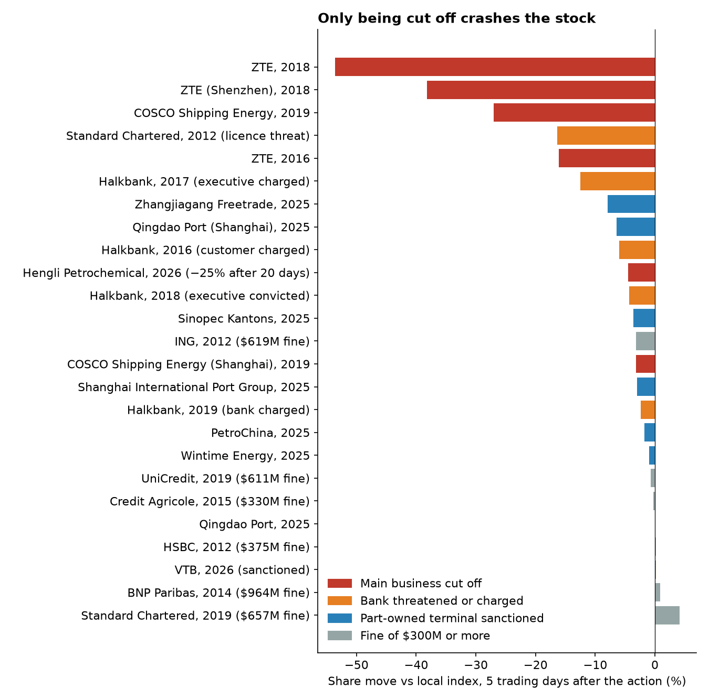
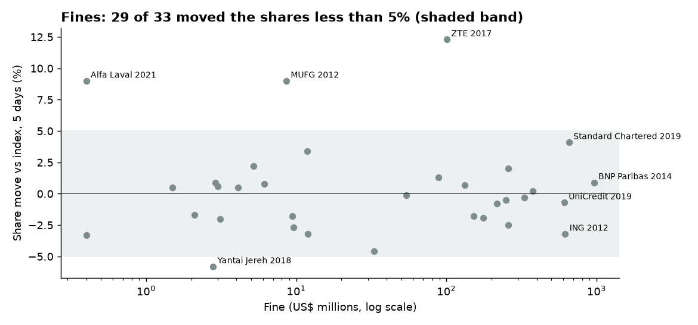
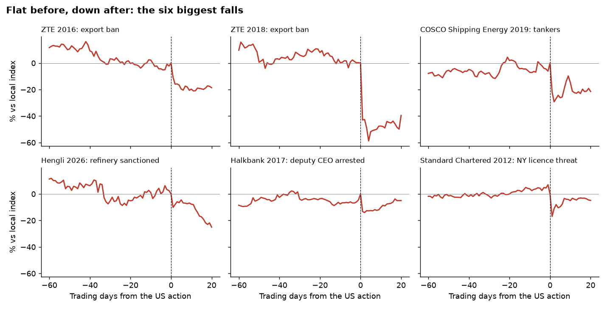
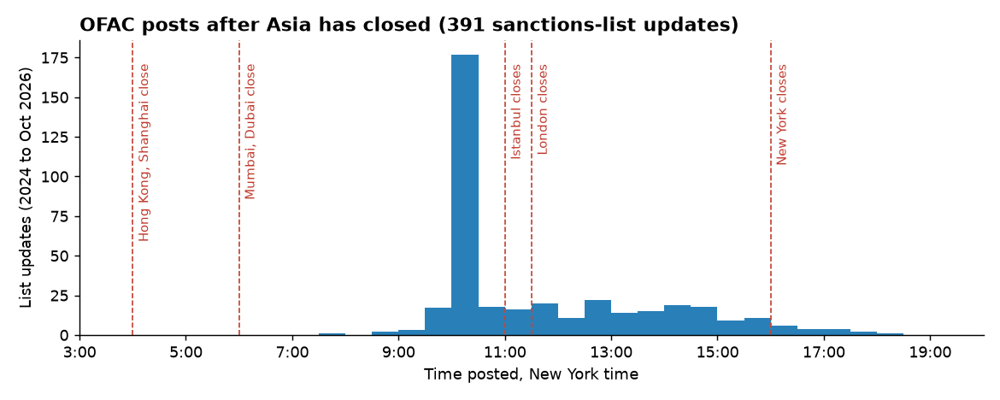
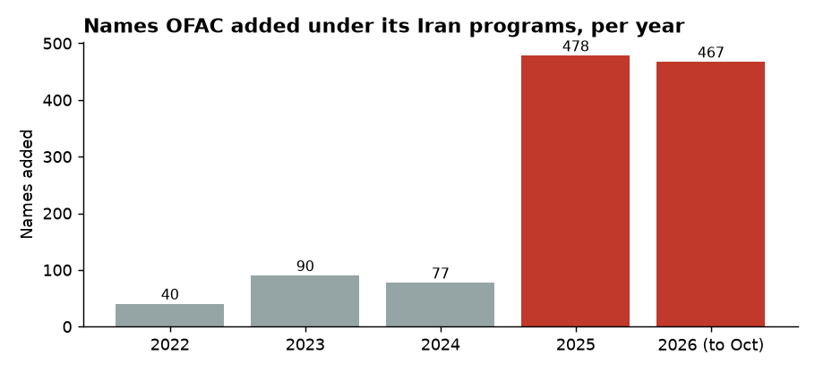

# When do US sanctions on Iran move a share price?

*Almost never. Fines, charges and sanctions on part-owned terminals barely move the stock. The big falls came when the US cut a company off from its main business or went after a bank's access to the US, and every one of them came after the US acted, not when the evidence came out.*

- **What this is:** a study of every US action over Iran against a stock-market-listed company since 2009, and what happened to its shares. We used it to look for the listed companies most at risk now.
- **Why it matters:** in 2026 the US widened its Iran sanctions from oil and banks to cars, rail, shipping, aviation, technology, gold and crypto. A foreign company in any of these sectors can now be cut off from US banks and the dollar, with no US link needed.
- **Where we looked:** US Treasury, Justice Department and court records; daily share prices around every one of those actions; Hong Kong and mainland Chinese company filings; Iranian banks' own websites; and 220,000 port visits by sanctioned ships.
- **What we found:** six share moves fell more than 10% in a week, from four companies: ZTE, COSCO Shipping Energy, Standard Chartered and Halkbank. Of the companies at risk now, none is both likely to be hit and likely to crash.

## The US hits listed companies over Iran often. It rarely hurts their shares.

**Takeaway: of more than 50 share moves we measured, the six that fell more than 10% in a week all came from losing a main business, or from a direct threat to a bank.**

*Figure 1. Share move against the local stock index, 5 trading days after the action. All sanctions and bank charges, plus fines of $300M or more. Data: [iran_enforcement_price_impact.csv](data/iran_enforcement_price_impact.csv), [bank_actions_price_impact.csv](data/bank_actions_price_impact.csv).*

Since 2009 the US has fined, charged or sanctioned listed companies and their subsidiaries over Iran about 50 times. Most were fines: 34 of them, mostly European banks that moved dollars for Iranian clients before 2016. In 29 of the 34, the shares moved less than 5% against the local index in the week after. That includes BNP Paribas's $964M in 2014, the largest. The size of the fine made no difference (Figure 2).

*Figure 2. Each dot is one US fine over Iran against a listed company, 2009 to 2024. The shaded band is ±5%. The three dots above it (ZTE 2017, MUFG 2012, Alfa Laval 2021) rose. The chart shows 33 fines; the 34th, Standard Chartered 2012 (−16%), had no fine amount yet when its shares fell, so it has no place on the x-axis. Data: [iran_enforcement_price_impact.csv](data/iran_enforcement_price_impact.csv).*

The biggest falls were a different kind of event. In each one the US took away, or threatened, something the company couldn't run without:

| Company | Year | What the US took away | Share move vs index |
|---|---|---|---|
| ZTE (Hong Kong) | 2018 | US chips: an export ban for breaking its 2017 Iran plea deal | −41% on the day trading restarted |
| COSCO Shipping Energy (Hong Kong) | 2019 | Two of its tanker companies, sanctioned for carrying Iranian oil | −27% in 5 days |
| Hengli Petrochemical (Shanghai) | 2026 | Its Dalian refinery, sanctioned for buying Iranian oil | −10% the next day (the daily limit), −25% in 20 days |
| ZTE (Hong Kong) | 2016 | US chips: its first export ban | −16% in 5 days |
| Standard Chartered (London) | 2012 | Nothing yet: a New York regulator threatened its licence to operate in New York | −17% the next day |

Halkbank is the one large fall that doesn't fit cleanly. It fell 13% the day after the US arrested its deputy CEO in 2017, the first sign that the case could reach the bank itself (our reading). When that charge came in 2019, the shares fell 2%.

In Figure 1, the blue bars are the 2025 sanctions on Chinese oil terminals. Treasury now sanctions one every few months, but each was a part-owned site inside a large group. Sinopec Kantons expects a HK$127M loss from closing its sanctioned terminal, and its first-half 2026 profit fell 31%, yet its shares fell only 4% in the week after the sanction. Qingdao Port owns 70% of a sanctioned terminal, and its Hong Kong shares didn't move.

**Every listed owner of a sanctioned Chinese oil terminal or refinery**

| Owner (listing) | Sanctioned site | Owner's stake | US action | Share move, 5 days | Owner's filing |
|---|---|---|---|---|---|
| Wintime Energy (Shanghai) | Huaying Huizhou terminal | 80% | [2025-03-20](https://ofac.treasury.gov/recent-actions/20250320) | −1.0% | [filing](http://static.cninfo.com.cn/finalpage/2025-12-13/1224874176.PDF) |
| Qingdao Port (Hong Kong / Shanghai) | Dongjiakou terminal | 70% | [2025-08-21](https://ofac.treasury.gov/recent-actions/20250821) | 0.0% / −6.4% | [filing](http://static.cninfo.com.cn/finalpage/2026-08-29/1225524260.PDF) |
| Zhangjiagang Freetrade (Shanghai) | Yangshan Shengang depot | 28% | [2025-08-21](https://ofac.treasury.gov/recent-actions/20250821) | −7.9% | [filing](http://static.cninfo.com.cn/finalpage/2026-08-15/1225473465.PDF) |
| PetroChina (Hong Kong) | Yangshan Shengang depot | 21% | [2025-08-21](https://ofac.treasury.gov/recent-actions/20250821) | −1.8% | [filing](http://static.cninfo.com.cn/finalpage/2025-05-31/1223735233.PDF) |
| Shanghai International Port (Shanghai) | Yangshan Shengang depot | shareholder | [2025-08-21](https://ofac.treasury.gov/recent-actions/20250821) | −3.0% | [filing](http://static.cninfo.com.cn/finalpage/2025-08-29/1224606804.PDF) |
| Sinopec Kantons (Hong Kong) | Rizhao Shihua terminal | 50% | [2025-10-09](https://ofac.treasury.gov/recent-actions/20251009) | −3.6% | [filing](https://www1.hkexnews.hk/listedco/listconews/sehk/2026/0227/2026022702200.pdf) |
| Hengli Petrochemical (Shanghai) | Hengli Dalian refinery | parent | [2026-04-24](https://ofac.treasury.gov/recent-actions/20260424) | −4.5% (−25% in 20 days) | 2026 half-year report (600346) |

*Share move against the local index. Hengli is in the table for completeness; it is the one case where the sanctioned site was the company's main business. Data: [listed_company_links.csv](data/listed_company_links.csv), [iran_enforcement_price_impact.csv](data/iran_enforcement_price_impact.csv).*

**So the test for a short has three parts.** The sanctioned business has to be most of the company. The company has to depend on something the US controls, such as chips, dollars or a New York licence. And the shares have to trade where a foreign fund can short them, which rules out most mainland-only listings.

## The market waits for the US to act

**Takeaway: in five of the six biggest falls, the shares were flat or up in the month before, even when the evidence had been public for years.**

We checked each big fall for public warnings beforehand. There were usually warnings, in the press or in earlier US actions, but almost never in the company's own filings. The share price ignored them.

| Case | What was public beforehand | 20 days before | After |
|---|---|---|---|
| [ZTE, 2016](case-studies/zte-2016.html) | Reuters reported its Iran surveillance sale in 2012, four years earlier | +0.4% | −20% in 5 days |
| [ZTE, 2018](case-studies/zte-2018.html) | The 2017 plea deal spelled out the suspended export ban; the breach that triggered it wasn't public | −7% | −43% the next day |
| [COSCO Shipping Energy, 2019](case-studies/cosco-shipping-energy-2019.html) | The US sanctioned another Chinese oil buyer two months earlier; nothing named COSCO | −2% | −26% in 5 days |
| [Hengli Petrochemical, 2026](case-studies/hengli-2026.html) | Four Chinese oil terminals sanctioned in 2025; nothing named Hengli | +6% | −25% in 20 days |
| [Halkbank, 2017](case-studies/halkbank-2017.html) | Its general manager detained in a 2013 Turkish Iran probe; Reza Zarrab, whose scheme ran through the bank, arrested by the US in 2016 | +4% | −13% the next day |
| [Standard Chartered, 2012](case-studies/standard-chartered-2012.html) | It had been investigating its own Iran payments since 2009; we haven't confirmed it said so publicly | 0% | −17% the next day |

*Share move against the local index, measured from the last close before the action. Each case links to its own page with sources and a price chart.*

*Figure 3. Each line is the company's share price against its local index, set to 0 at the last close before the US action (dashed line). Only ZTE 2018 slid beforehand, about 7% in the last month, against a fall of more than 40% after. Data: [case_study_price_paths.csv](data/case_study_price_paths.csv).*

Halkbank is the clearest example. Its link to the Zarrab scheme was public from March 2016, and the shares rose 13% against the Istanbul index in the 60 trading days before its deputy CEO's arrest.

This matters for anyone trading on public evidence. A short is paid only if the US acts while the position is open, and in these cases the wait after the first public warning was up to four years.

## The fall comes at the next open

**Takeaway: OFAC usually posts at about 10 am New York time, after Asia has closed, so Hong Kong and mainland shares take the whole hit at the next morning's open. Being fast doesn't help there.**

The first place a US sanctions action appears is OFAC's [sanctions-list service](https://sanctionslistservice.ofac.treas.gov/changes/history/2026), which timestamps every update. Of its 391 updates from 2024 to October 2026, 195 went out between 10:00 and 10:59 am New York time. The Treasury press release comes later.

*Figure 4. Every update to OFAC's sanctions lists, 2024 to October 2026, by the time it was posted. Dashed lines are market closes in New York time during US summer time; in winter, London and Istanbul close an hour later. Data: [ofac_list_publication_times.csv](data/ofac_list_publication_times.csv).*

By 10 am in New York, Hong Kong, Shanghai, Mumbai and Dubai have closed. Their shares react about 11 hours later, at the open, when everyone has seen the news. COSCO Shipping Energy opened 25% down and was 26% down a week later. Only Istanbul, London and Moscow still have about an hour of trading left, so a fast reader could matter only for Turkish, British and Russian banks.

**Almost all of the fall happens at the first open** (share move in the first session after the action; local index in brackets)

| Company | Action date | At the open | At the close | After 5 days |
|---|---|---|---|---|
| COSCO Shipping Energy (Hong Kong) | 2019-09-25 | −25.0% (−0.4%) | −21.1% (+0.6%) | −26.4% |
| ZTE (Hong Kong), after its suspension | 2016-03-07 | −13.7% (+0.7%) | −10.3% (+0.5%) | −14.7% |
| Hengli Petrochemical (Shanghai) | 2026-04-24 | −10.0% (−0.1%), the daily limit | −10.0% (+0.2%) | −2.5% |
| Halkbank, deputy CEO arrested (Istanbul) | 2017-03-28 | −10.6% (−1.0%) | −14.3% (−1.0%) | −14.3% |
| Halkbank, bank charged (Istanbul) | 2019-10-15 | −7.2% (−1.8%) | −3.5% (−1.2%) | +0.4% |
| Sinopec Kantons (Hong Kong) | 2025-10-09 | −1.8% (−0.9%) | −4.3% (−1.7%) | −6.9% |
| Industrial Bank of Korea (Seoul) | 2020-04-20 | −1.8% (−0.6%) | −2.9% (−1.0%) | −1.0% |
| Qingdao Port (Hong Kong) | 2025-08-21 | 0.0% (+0.4%) | −0.6% (+0.9%) | −0.5% |
| PetroChina (Hong Kong) | 2025-08-21 | 0.0% (+0.4%) | −0.5% (+0.9%) | −2.3% |

*Raw share moves, not against the index; the index's own move is in brackets. Data: [next_open_reaction.csv](data/next_open_reaction.csv).*

## Where the next big fall could come from

**Takeaway: we found no listed company that is both likely to be hit and likely to crash if it is.**

We screened five areas against the three-part test, then checked each with company filings, court records and sanctions data. The pace of US action is the reason to look now. OFAC added more names under its Iran programs in 2025 than in the three years before combined, and 2026 is on the same pace (Figure 5).

*Figure 5. Entries tagged with an Iran program (IRAN, IFSR, IRGC and the Iran executive orders) on the OFAC Recent Actions pages we parsed. A name listed twice in a year counts twice. Data: [ofac_iran_designations.csv](data/ofac_iran_designations.csv).*

| Area | Example names | Likely to be hit? | Would the shares crash? | Can it be shorted? |
|---|---|---|---|---|
| Chinese oil terminals | Sinopec Kantons (HKEX 00934), Qingdao Port (HKEX 06198) | Yes: one every few months since 2025 | No: past cases moved owners 0–8% | Yes, in Hong Kong |
| Suppliers to Iran's carmakers | Linglong Tyre (SSE 601966), Anpeilong (SZSE 301413) | Possibly: sanctionable since 2026-10-01; both named Iranian customers in recent filings | Not known: we haven't found what share of sales is Iranian | Hardly: listed only in mainland China |
| Banks handling Iranian money | Halkbank (Borsa Istanbul), UCO Bank (NSE) | Less likely: no listed non-Chinese bank has been cut off over Iran | Yes, if cut off from dollars | Yes |
| Electronics makers | Parts makers found in Iranian drones | Unlikely: the parts are sold through distributors | Not if the sale was indirect | Mostly yes, in Taiwan and Hong Kong |
| Listed tanker owners | None named yet | Not checked in full: we haven't found a listed owner of the sanctioned ships we traced | Yes, if the ships are most of its business (COSCO 2019) | Mostly yes, in Hong Kong |

Two banks come closest to the test.

- **Halkbank (about $6.5bn market value).** In March 2026 it agreed a deal with the US Justice Department that bars it from transactions benefiting Iran, according to Turkey's Anadolu agency, and the case was dropped in June. New Iran business would break that deal.
- **UCO Bank (about $3bn).** Its CEO said in July 2026 that it still runs rupee trade accounts with Iranian banks, which it calls sanctions-compliant. On 2026-10-05 OFAC warned all foreign banks that they "could be targeted at any time without advance notification" if they keep dealing with sanctioned Iranian banks.

US court records from the Halkbank case also name QNB Bank, Bank of Baroda's Dubai branch, and units of Emirates NBD and Saudi National Bank as holding accounts in the scheme. That evidence dates from 2012 to 2016, and we found nothing showing they still handle Iranian money.

**Every listed bank named in the evidence**

| Bank (listing) | Market value | What the record shows | Evidence | Source |
|---|---|---|---|---|
| UCO Bank (NSE) | about $3.0bn | CEO said in July 2026 it still runs rupee trade accounts with Iranian banks | Documented, current | [interview](https://github.com/pvijeh/iran-oil-terminals/blob/main/receipts/banks/listed-bank-filings/in-uco-2026-07-23_livemint_iran-rupee-channel.png) |
| Halkbank (Borsa Istanbul) | about $6.5bn | Ran the Zarrab scheme; March 2026 deal bars Iran-benefiting transactions | US action | [Anadolu report](https://github.com/pvijeh/iran-oil-terminals/blob/main/receipts/banks/listed-bank-filings/tr-halkbank-2026-03-09_anadolu_dpa.png) |
| QNB Bank (Borsa Istanbul) | about $18.9bn | Account used in the gold-for-payments chain, 2012–2016 | Documented, old | [trial transcript](https://github.com/pvijeh/iran-oil-terminals/blob/main/receipts/banks/zarrab-halkbank-court/sdny-1-15-cr-00867_doc402_pages-68-89-117-125.pdf) |
| Bank of Baroda (NSE) | about $12.5bn | Dubai branch held a Zarrab front company's account | Documented, old | [trial transcript](https://github.com/pvijeh/iran-oil-terminals/blob/main/receipts/banks/zarrab-halkbank-court/sdny-1-15-cr-00867_doc410_pages-79-81-95.pdf) |
| Emirates NBD (Dubai), owner of Denizbank | about $53bn | Denizbank held a front company's account; Denizbank denied taking part | Documented, old | [trial transcript](https://github.com/pvijeh/iran-oil-terminals/blob/main/receipts/banks/zarrab-halkbank-court/sdny-1-15-cr-00867_doc408_pages-45-50.pdf) |
| Saudi National Bank (Tadawul), owner of Türkiye Finans | – | Türkiye Finans sat in a payment chain between Halkbank and Bank of Baroda | Documented, old | [trial transcript](https://github.com/pvijeh/iran-oil-terminals/blob/main/receipts/banks/zarrab-halkbank-court/sdny-1-15-cr-00867_doc408_pages-45-50.pdf) |
| Woori Bank, Industrial Bank of Korea (KRX) | – | A Treasury witness said the US was "worried" about their Iran transactions; IBK paid $86M in 2020 | Documented | [trial transcript](https://github.com/pvijeh/iran-oil-terminals/blob/main/receipts/banks/zarrab-halkbank-court/sdny-1-15-cr-00867_doc418_pages-42.pdf) |
| HSBC (Hong Kong, London) | – | 2025 annual report lists about 14 old guarantees involving Iranian banks, being wound down | Own filing | [annual report pages](https://github.com/pvijeh/iran-oil-terminals/blob/main/receipts/banks/listed-bank-filings/hk-hsbc-2026-02-26_20F-FY2025_iran-pages.pdf) |
| Standard Chartered (London, Hong Kong) | – | New York branch cleared dollars for an exchange house in the scheme | Documented, old | [trial transcript](https://github.com/pvijeh/iran-oil-terminals/blob/main/receipts/banks/zarrab-halkbank-court/sdny-1-15-cr-00867_doc410_pages-79-81-95.pdf) |
| VakifBank, Garanti BBVA (Borsa Istanbul) | – | Named by Zarrab as banks he hoped to use; no transfers shown | Lead | [trial transcript](https://github.com/pvijeh/iran-oil-terminals/blob/main/receipts/banks/zarrab-halkbank-court/sdny-1-15-cr-00867_doc406_pages-18-24-28-37-76.pdf) |

*Market values as of 2026-10-06; "–" means not captured. "Documented" means a court record, filing or the bank's own statement shows the link. "Old" means 2012–2016. All 134 named banks, listed or not, are in [bank_leads.csv](data/bank_leads.csv).*

The market has already seen this record. Halkbank fell 58% from 2015 to 2019 while Istanbul's bank index was flat and VakifBank, Garanti and Akbank each rose 6–15%. Most of the gap opened between the US actions, not on the days they were announced.

*Halkbank's share price against Borsa Istanbul's bank index, with each US action marked. The chart stops at 2019 because the free price data doesn't adjust for Halkbank's 2020 and 2022 share issues.*

## Our view

**Public evidence of Iran ties is not enough to short a stock.** The market has ignored years of it, on ZTE and on Halkbank, until the US acted. The companies the US now sanctions most often, Chinese oil terminals, are small parts of large groups, and their sanctions barely register in the share price.

The case that would crash a stock is a listed bank cut off from US dollars, or a company whose main business depends on Iran. Neither has turned up in the public record yet. The October 2026 warning to foreign banks makes the first more likely than it has been, and UCO Bank is the listed bank that says it is still doing the business the warning targets. If we had to name one company to watch, it would be UCO.

## Appendix

- **Full findings:** every table, chart and source behind this page, including the 2026 rules, the bank evidence, ship tracking, Europe and drone parts: [findings](findings.html).
- **Case studies:** [all six](case-studies/), with saved copies of every source in [receipts/case-studies](https://github.com/pvijeh/iran-oil-terminals/tree/main/receipts/case-studies).
- **How we measured share moves:** daily closing prices from Yahoo Finance; the company's change minus the local index's change, from the last close before the US action. Standard Chartered's order came after London closed, so its count starts the next London session. ZTE's shares were suspended both times; for ZTE the count starts when trading restarted, with the index measured over the same dates.
- **Data and code:** [data/](https://github.com/pvijeh/iran-oil-terminals/tree/main/data) and [scripts/](https://github.com/pvijeh/iran-oil-terminals/tree/main/scripts). Figure 1 is from `scripts/essay_chart.py`; Figures 2 to 5 from `scripts/report_figures.py`.
- **What "sanctioned" means here:** listed by the US Treasury's Office of Foreign Assets Control (OFAC) under its Iran programs. These are US measures; buying from Iran is not illegal under Chinese law. This page is research, not investment advice.
